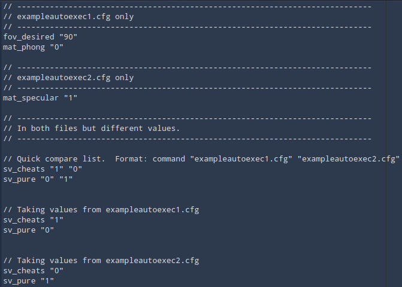

# Config Compare
Compares two configs for Valve Source games.
For example if your two input configs are:

Then the output would be

## Usage

Edit config.py first with the locations of the config files you want to compare, and words to ignore.  Then run the program.

`python main.py`
